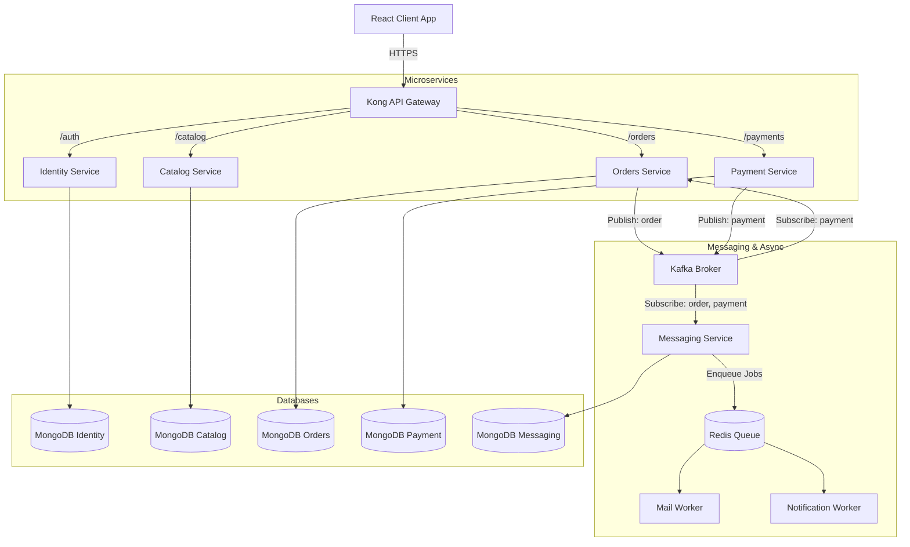

# VenDeX System Architecture

This document describes the architectural layout, communication patterns, and database configurations for the VenDeX Multi-Vendor E-Commerce platform.

---

## 1. High-Level Architecture

The platform uses a microservices architecture coordinated via a centralized API gateway (Kong) for ingress routing, and Apache Kafka for asynchronous event-driven choreography.

---

## 2. Service Definitions

### Identity Service (`identity-service`)
- **Port**: `3001`
- **Purpose**: Handles user signups, signins, token generation (JWT), and role-based permissions (`USER`, `ADMIN`).
- **Database**: MongoDB (Identity Collections).

### Catalog Service (`catalog-service`)
- **Port**: `3003`
- **Purpose**: Manages product inventories, details, categories, and atomic stock allocations.
- **Stock Control**: Implements endpoints for `/inventory/reserve`, `/inventory/release`, and `/inventory/confirm` to prevent race conditions during concurrent checkouts.
- **Database**: MongoDB (Product and Category Collections).

### Orders Service (`orders-service`)
- **Port**: `3002`
- **Purpose**: Facilitates order creation, state transitions, and price calculations.
- **Checkout Flow**: Derives `customerId` directly from the authenticated JWT token. Orchestrates stock reservations via synchronous REST calls to the `catalog-service` before processing payments.
- **Database**: MongoDB (Order Collections).

### Payment Service (`payment-service`)
- **Port**: `3004`
- **Purpose**: Integrates with third-party payment gateways (Razorpay). Validates payment signatures and handles webhooks.
- **Database**: MongoDB (Transactions).

### Messaging Service (`messaging-service`)
- **Port**: `3005`
- **Purpose**: Captures application events (users registered, orders created, payments processed) off the Kafka cluster and delegates them to redis-backed BullMQ instances for background worker dispatch.
- **Workers**: `mail-worker` and `notification-worker` consume queues to send transactional emails and notifications.

---

## 3. Communication Patterns

### Synchronous REST (HTTP)
Used for critical real-time operations where immediate confirmation is required.
- **Example**: `orders-service` requesting stock reservation from `catalog-service` during checkout.

### Asynchronous Events (Kafka)
Used to keep services loosely coupled and ensure eventual consistency.
- **Example**: `payment-service` publishes a `PAYMENT_SUCCESS` event. The `orders-service` consumes this event to update the order state to `CONFIRMED` and finalize stock reservations. The `messaging-service` consumes it to trigger customer receipts.
