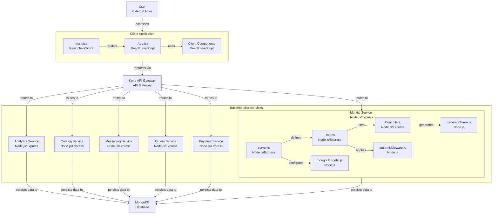

```mermaid
graph TD

    4["User<br>External Actor"]
    5["Kong API Gateway<br>API Gateway"]
    6["MongoDB<br>Database"]
    subgraph 1["Backend Microservices"]
        10["Analytics Service<br>Node.js/Express"]
        11["Catalog Service<br>Node.js/Express"]
        12["Messaging Service<br>Node.js/Express"]
        13["Orders Service<br>Node.js/Express"]
        14["Payment Service<br>Node.js/Express"]
        subgraph 2["Identity Service<br>Node.js/Express"]
            15["server.js<br>Node.js/Express"]
            16["Routes<br>Node.js/Express"]
            17["Controllers<br>Node.js/Express"]
            18["auth.middleware.js<br>Node.js"]
            19["generateToken.js<br>Node.js"]
            20["mongodb.config.js<br>Node.js"]
            %% Edges at this level (grouped by source)
            15["server.js<br>Node.js/Express"] -->|defines| 16["Routes<br>Node.js/Express"]
            15["server.js<br>Node.js/Express"] -->|configures| 20["mongodb.config.js<br>Node.js"]
            16["Routes<br>Node.js/Express"] -->|uses| 17["Controllers<br>Node.js/Express"]
            16["Routes<br>Node.js/Express"] -->|applies| 18["auth.middleware.js<br>Node.js"]
            17["Controllers<br>Node.js/Express"] -->|generates| 19["generateToken.js<br>Node.js"]
        end
    end
    subgraph 3["Client Application"]
        7["main.jsx<br>React/JavaScript"]
        8["App.jsx<br>React/JavaScript"]
        9["Client Components<br>React/JavaScript"]
        %% Edges at this level (grouped by source)
        7["main.jsx<br>React/JavaScript"] -->|renders| 8["App.jsx<br>React/JavaScript"]
        8["App.jsx<br>React/JavaScript"] -->|uses| 9["Client Components<br>React/JavaScript"]
    end
    %% Edges at this level (grouped by source)
    5["Kong API Gateway<br>API Gateway"] -->|routes to| 2["Identity Service<br>Node.js/Express"]
    5["Kong API Gateway<br>API Gateway"] -->|routes to| 10["Analytics Service<br>Node.js/Express"]
    5["Kong API Gateway<br>API Gateway"] -->|routes to| 11["Catalog Service<br>Node.js/Express"]
    5["Kong API Gateway<br>API Gateway"] -->|routes to| 12["Messaging Service<br>Node.js/Express"]
    5["Kong API Gateway<br>API Gateway"] -->|routes to| 13["Orders Service<br>Node.js/Express"]
    5["Kong API Gateway<br>API Gateway"] -->|routes to| 14["Payment Service<br>Node.js/Express"]
    4["User<br>External Actor"] -->|accesses| 3["Client Application"]
    3["Client Application"] -->|requests via| 5["Kong API Gateway<br>API Gateway"]
    2["Identity Service<br>Node.js/Express"] -->|persists data to| 6["MongoDB<br>Database"]
    10["Analytics Service<br>Node.js/Express"] -->|persists data to| 6["MongoDB<br>Database"]
    11["Catalog Service<br>Node.js/Express"] -->|persists data to| 6["MongoDB<br>Database"]
    12["Messaging Service<br>Node.js/Express"] -->|persists data to| 6["MongoDB<br>Database"]
    13["Orders Service<br>Node.js/Express"] -->|persists data to| 6["MongoDB<br>Database"]
    14["Payment Service<br>Node.js/Express"] -->|persists data to| 6["MongoDB<br>Database"]

```
