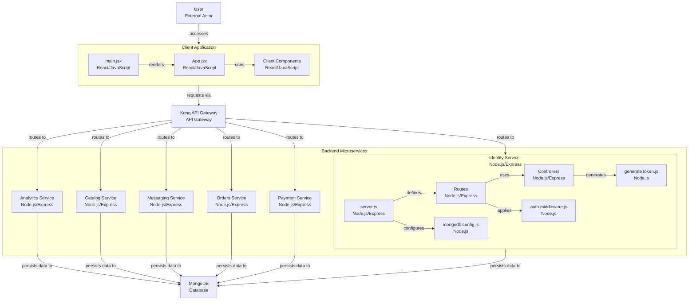
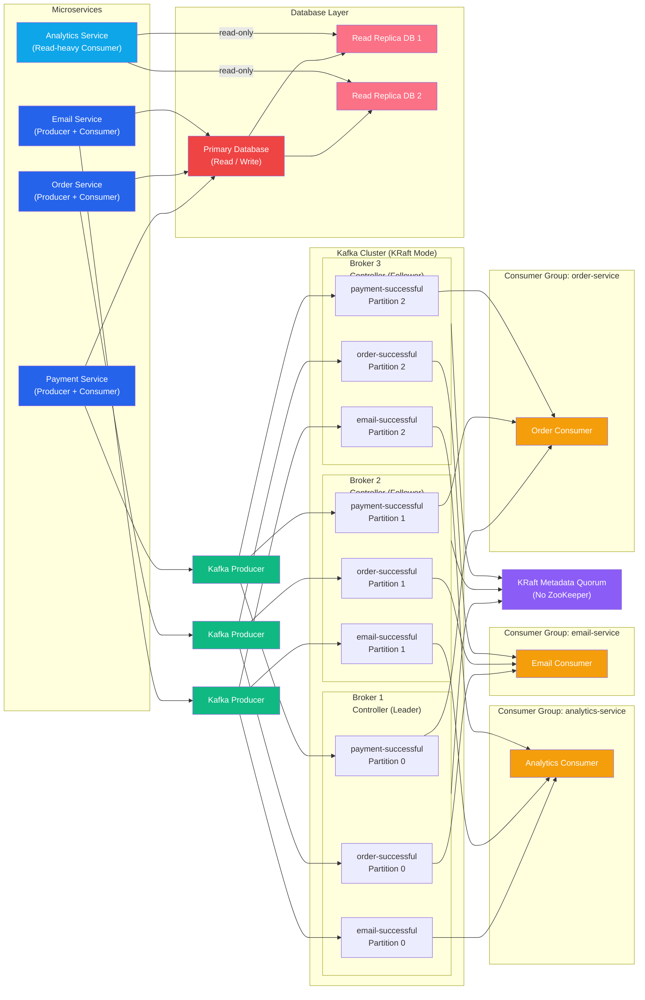
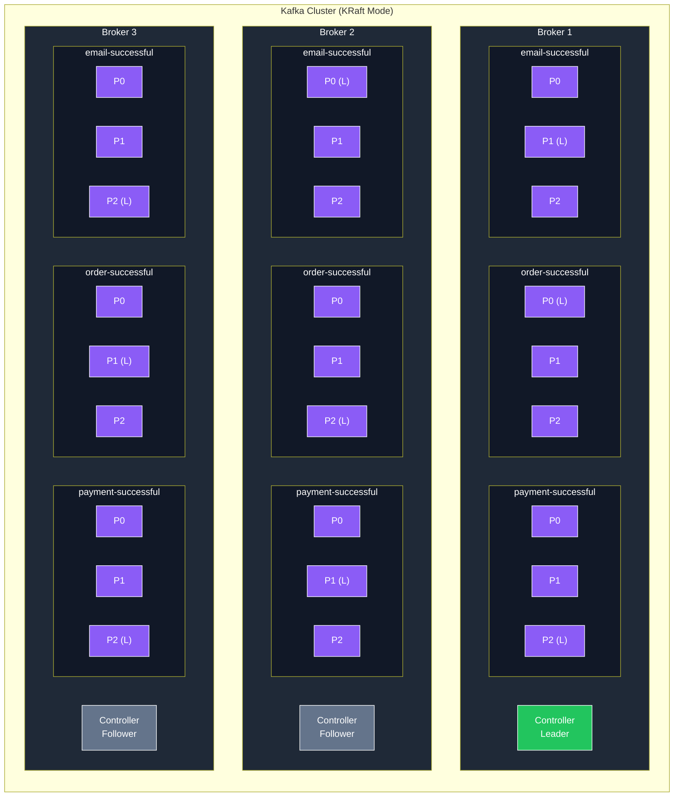

# Mutli-Vendor E-Commerce Website <i>(Micro Servies Architecture)</i>

> [!IMPORTANT]
> This project is still under active development.

# API Sever Architecture Diagram

## Kafka Cluster

## Docker Enviromnet 

## CI/CD Pipline (Jenkins)

### Stage Diagram

