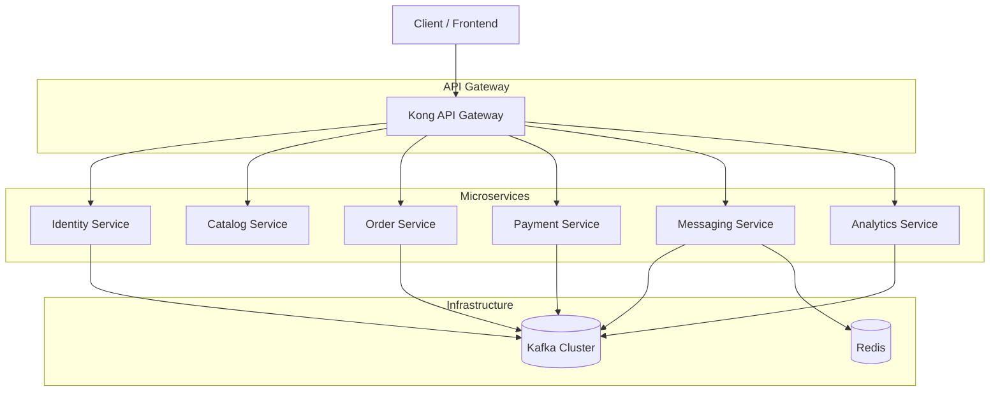
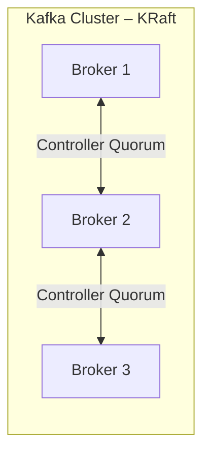
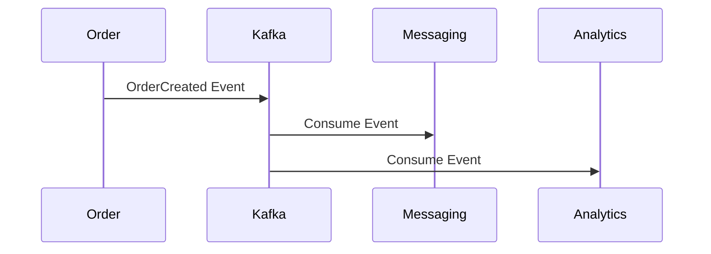

# MVEC - Docker Setup

## Overview

This project implements a **production‑grade microservices architecture** for a multi‑vendor e‑commerce platform. The system is designed to demonstrate **scalability, fault isolation, asynchronous communication, and infrastructure separation**, using Docker Compose, Kafka (KRaft mode), Redis, and Kong API Gateway.

The architecture is intentionally modular and close to real‑world industry setups, making it suitable for **learning, portfolio, and resume‑ready demonstrations**.

## Architecture Diagram



## Infrastructure Separation Strategy

The system is intentionally split into **three Docker Compose files** to mirror real‑world environments:

| Compose File        | Purpose                                                         |
| ------------------- | --------------------------------------------------------------- |
| `app.compose.yml`   | Core application microservices and API gateway                  |
| `deps.compose.yml`  | Shared infrastructure dependencies (Redis, observability stack) |
| `kafka.compose.yml` | Dedicated Kafka cluster (KRaft mode, multi‑broker)              |

This separation allows:

* Independent scaling
* Faster local development
* Clear operational boundaries

## API Gateway – Kong

Kong acts as the **single entry point** for all external traffic.

**Responsibilities:**

* Request routing
* Centralized access logs
* Gateway‑level concerns (rate limiting, auth plugins in future)

**Key Configuration Highlights:**

* DB‑less mode (declarative configuration)
* Admin API exposed on port `8001`
* Proxy exposed on port `8000`

```yaml
KONG_DATABASE: "off"
KONG_DECLARATIVE_CONFIG: /usr/local/kong/declarative/kong.yml
```

## Microservices Responsibilities

| Service           | Port | Core Responsibility                        |
| ----------------- | ---- | ------------------------------------------ |
| Identity Service  | 3001 | User authentication, identity events       |
| Catalog Service   | 3002 | Product and vendor catalog management      |
| Messaging Service | 3003 | Email, notifications, async messaging      |
| Order Service     | 3004 | Order lifecycle management                 |
| Payment Service   | 3005 | Payment processing and events              |
| Analytics Service | 3000 | Event consumption and analytics processing |

Each service:

* Owns its domain
* Communicates synchronously via HTTP (through Kong)
* Communicates asynchronously via Kafka events

## Kafka Cluster (KRaft Mode)

The messaging backbone is a **3‑broker Kafka cluster running in KRaft mode** (no ZooKeeper).



**Key Characteristics:**

* Brokers also act as controllers
* High availability via quorum voters
* Internal and external listeners separated

**External Ports:**

* Broker 1 → 9094
* Broker 2 → 9095
* Broker 3 → 9096

## Event‑Driven Communication Model

Kafka enables **loose coupling** between services.

Typical event flow:

1. Identity / Order / Payment emits an event
2. Kafka persists and distributes the event
3. Messaging / Analytics consume independently



This ensures:

* No synchronous dependencies
* Better fault tolerance
* Horizontal scalability

## Redis Usage

Redis is used as a **fast in‑memory datastore** for:

* Background job queues (BullMQ)
* Rate limiting
* Temporary state and caching


Redis runs independently and can be restarted without impacting Kafka or core services.

## Kafka UI

Kafka UI is included for **observability and debugging**.

**Features:**

* View topics and partitions
* Monitor consumer groups
* Inspect messages

**Access:**

* [http://localhost:8081](http://localhost:8081)

## Docker Networks

All services run inside a shared **external Docker network**:

```yaml
networks:
  vendex-infra:
    external: true
```

This enables:

* Cross‑compose communication
* Clean service discovery by container name

## Startup Order

Recommended startup sequence:

```bash
# Create network (once)
docker network create vendex-infra

# Start Kafka cluster
docker compose -p kafka-brokers -f kafka.compose.yml up -d

# Start shared dependencies
docker compose -p micro-services-deps -f deps.compose.yml up -d

# Start application services
docker compose -p micro-services-app -f app.compose.yml up -d
```

## Why This Architecture Matters

This project demonstrates:

* Realistic microservices boundaries
* Event‑driven design using Kafka
* API Gateway usage with Kong
* Infrastructure separation
* Production‑like Docker Compose organization

It is intentionally **not over‑simplified**, making it a strong representation of modern backend engineering practices.

## Future Enhancements

* Auth and rate‑limit plugins in Kong
* Prometheus + Grafana observability
* Distributed tracing
* Schema registry for Kafka
* CI/CD pipeline with Jenkins

## Conclusion

This repository represents a **clean, scalable, and industry‑aligned microservices architecture** suitable for learning, experimentation, and professional showcasing.
